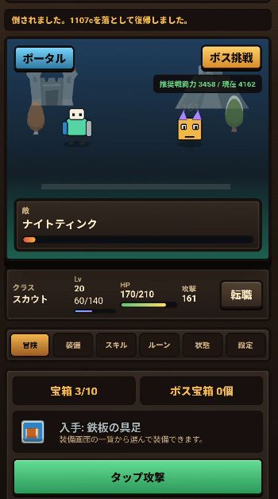

# Onbord Hero

## スクリーンショット

開発途中のイメージ図程度になります

## 概要

個人で開発しているAndroid向け放置RPGです。

企画・ゲームデザイン・システム設計・実装・テスト・改善までを一人で担当し、生成AIを開発パートナーとして活用しながら開発を進めています。

本リポジトリはポートフォリオ公開用です。  
ゲーム本体のソースコードは非公開で管理しています。

---

## 技術構成

- Java
- Android Studio
- Capacitor
- Git / GitHub
- HTML / CSS / JavaScript
- localStorage

---

## AI活用

- ChatGPT
- Claude Code
- OpenAI Codex

生成AIを単なるコード生成ツールではなく、仕様整理、設計レビュー、コードレビュー、リファクタリング、バグ調査、UI改善、ドキュメント作成に活用しています。

最終的な設計・実装判断は自分で行い、AIを活用することで開発効率と品質向上を両立しています。

---

## 担当範囲

- ゲーム企画
- ゲームデザイン
- システム設計
- 実装
- UI設計
- ゲームバランス調整
- Gitによるバージョン管理
- 実機検証
- AIを活用した開発プロセス設計

---

## 主な機能

- 放置バトル
- 装備システム
- ジョブシステム
- オフライン報酬
- レア敵システム
- ミニウィンドウ機能
- ランキング機能（開発中）

---

## 開発で意識していること

- 実機検証を前提とした改善
- 運用を考慮した設計
- 保守しやすいコード構成
- Gitによる変更履歴管理
- ドキュメントを残しながら開発を進めること
- AI任せにせず、自分で判断して品質を担保すること

---

## 公開方針

本プロジェクトは将来的なGoogle Play公開を想定しているため、以下は非公開としています。

- ソースコード
- ゲーム内アセット
- 詳細なゲームバランス
- 未公開機能の具体仕様

一方で、使用技術・開発プロセス・AI活用方法については、ポートフォリオとして公開しています。

